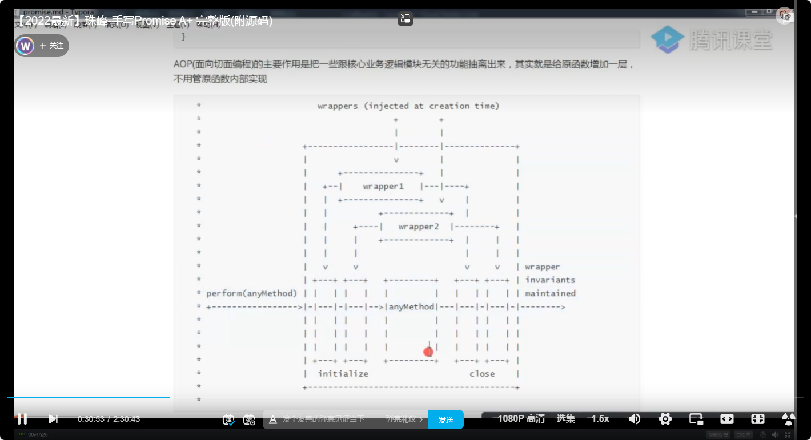
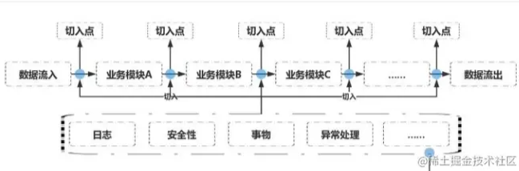

[TOC]

# 珠峰手写Promise

## 前置编程思想

### AOP--面向切片编程

```
参考资料
https://juejin.cn/post/7011797590207365128
https://juejin.cn/post/6844903796129136654
```



面向切面的程序设计（Aspect-oriented programming，AOP，又译作面向方面的程序设计、剖面导向程序设计）是计算机科学中的一种程序设计思想，旨在将横切关注点与业务主体进行进一步分离，以提高程序代码的模块化程度。面向切面的程序设计思想也是面向切面软件开发的基础。切面的概念源于对面向对象的程序设计和计算反射的融合，但并不只限于此，它还可以用来改进传统的函数。与切面相关的编程概念还包括元对象协议、主题（Subject）、混入（Mixin）和委托（Delegate）。

面向切面编程为我们提供了一种将代码注入现有函数或对象的方法，而无需修改目标逻辑。

注入的代码虽然不是必需的，但在具有横切关注点的，例如添加日志记录功能、调试元数据、性能统计、安全控制、事务处理、异常处理或不那么通用的功能，可以在不影响原始代码的情况下注入额外的行为。把它们抽离出来，用“动态”插入的方式嵌到各业务逻辑中。业务模块可以变得比较干净，不受污染，同时这些功能点能够得到很好的复用，给模块解耦。



```js
function say(who) {
  console.log(who + "说话");
}
Function.prototype.before = function (cb) {
  // 写法一
  //   return function () {
  //     cb();
  //     this(); //有this指向问题  可在外侧let that = this
  //   };
  // 写法二  采用ES6解决this指向
  return (...arg) => {
    console.log("arg: ", arg);
      cb();
      // console.log("this: ", this);
      // this(...arg)
  }
};
let newFn = say.before(function () {
  console.log("说话前");
});

newFn('Terraria');
```

- 上面的代码，在**Function**的原型上添加方法**before**，接受一个函数作为参数，且返回一个函数，所以调用**newFn**也将返回一个函数

- 在**before**的内部，我们可以先调用传入的函数，在使用**this()**调用**say**方法，因为这里是箭头函数，所以**this**也就是**say**, 使用**ES5**的写法则需要使用 **let that = this**

- 为什么**...arg**可以接收到**newFn('Terraria')**中的参数，因为**newFnqi**其实是函数

  - ```js
    (...arg) => {
        console.log("arg: ", arg);
          cb();
          // console.log("this: ", this);
          // this(...arg)
      }
    ```

    newFn('Terraria')也就是相当是：

    ```js
    (() => {
        console.log("arg: ", arg);
          cb();
          // console.log("this: ", this);
          // this(...arg)
      })('Terraria')
    ```

    所以 **...arg**可以接受到所有传入的参数，并将其封装到一个数组里

### 事件发布&订阅

我的理解是：

- 首先有一个保存订阅的事件的数组
- 有一个方法要将订阅的事件添加到数组里
- 在时机成熟时有一个方法要对数组的里方法进行触发
- 最好是把这些逻辑封装成一个对象

下面的代码中的 **event** 实现的基本就是这样

先订阅事件，事件触发时，再根据内部的逻辑判断执行哪些事件

```js
let fs = require('fs');

let event = {
    _arr: [],
    on(cb){
        this._arr.push(cb);
    },
    emit(){
        this._arr.forEach(cb => cb())
    }
}

let player = []
event.on(function(){
    console.log("读取一个");
})
event.on(function(){
    if(player.length == 2 ){
        console.log('over player: ', player);
    }
})

fs.readFile('.\/1.txt', 'utf8', (err, data)=>{
    player.push(data)
    event.emit()
})
fs.readFile('./2.txt', 'utf8', (err, data)=>{
    player.push(data)
    event.emit()
})
```

### 观察者模式

**观察者模式的一个优点是实现了观察者和被观察者的解耦，被观察者不需要知道观察者的具体细节，只需要通知观察者即可。这有助于代码的灵活性和可维护性。**

挺像Vue2中的依赖收集

- 有一个观察者实例和一个被观察者实例
- 被观测者在内部有一个保存着谁在观测他其的数组
- 被观测者在内部有一个更新状态的方法，一旦状态更新，该方法会通知所有观察者数组的成员，并将新的状态传递过去，也就是带着新的状态触发观测者的方法，实现响应式

下面的例子，宝宝实例会将爸爸和妈妈的实例对象先加入观测者的数组，当宝宝状态发生改变，通知数组里的成员并携带着新状态去调用相关方法

```js
class Subject{
    constructor(){
        this.state = '开心的一批'
        this.arr = []
    }
    attach(o){
        this.arr.push(o)
    }
    setState(newValue){
        this.state = newValue;
        this.arr.forEach(o => o.updata(newValue))
    }
}
// 观察者
class Observer{
    constructor(name){
        this.name = name
    }
    updata(newValue){
        console.log("name: " + this.name + ',    baby状态是: ' + newValue);
    }
}

let baby = new Subject;
let mm = new Observer('宝宝他妈');
let bb = new Observer('宝宝他爸');
baby.attach(mm)
baby.attach(bb)
baby.setState("困得一批")
```

### 装饰器模式

称为"装饰器模式"（Decorator Pattern）

装饰器模式是一种结构型设计模式，允许通过将对象放入包装对象中来动态地扩展其行为。在这里，`perform` 函数接受两个参数：`anyMethods` 和 `wrappers`。

- `anyMethods` 是一个函数，代表了要执行的具体操作。
- `wrappers` 是一个包含了多个装饰器对象的数组，每个装饰器对象都有 `initialize` 和 `close` 方法，分别在操作执行前后进行一些初始化和清理工作。

在 `perform` 函数内部，首先通过循环调用 `wrappers` 数组中每个装饰器的 `initialize` 方法，然后执行 `anyMethods` 函数，最后再次循环调用 `wrappers` 数组中每个装饰器的 `close` 方法。

这样一来，通过使用装饰器模式，你可以在不修改原始操作（`anyMethods`）的情况下，动态地添加一些前置和后置的功能，以满足不同的需求。这种模式可以使代码更加灵活和可扩展。

```js
function perform(anyMethods, wrappers) {
  wrappers.forEach((wrapper) => wrapper.initialize());
  anyMethods();
  wrappers.forEach((wrapper) => wrapper.close());
}

perform(
  function () {
    console.log("say");
  },
  [
    {
      initialize() {
        console.log("say前");
      },
      close() {
        console.log("say后");
      },
    },
    {
      initialize() {
        console.log("say前前");
      },
      close() {
        console.log("say后后");
      },
    },
  ]
);
```


## 手写Promise

- new Promise失败状态也会reject

- 官方术语

  - promise 是一个有then方法的对象或者是函数，行为遵循本规范

  - thenable 是一个有then方法的对象或者是函数

  - value 是promise状态成功时的值，包括 undefined/thenable或者是 promise

  - exception 是一个使用throw抛出的异常值

  - reason 是promise状态失败时的值

### 首先初始化状态和方法

```js
  constructor(executor) {
    this.state = PENDING;
    this.value = undefined; // 成功的结果
    this.reason = undefined; // 失败的原因
    this.onResolvedCallbacks = [];
    this.onRejectedCallbacks = [];

    let resolve = (value) => { //添加判断，状态一旦更改就不可变
      if ((this.state === PENDING)) {
        this.state = RESOLVE;
        this.value = value;
        this.onResolvedCallbacks.forEach((cb) => cb());
      }
    };
    let reject = (reason) => {
      if ((this.state === PENDING)) {
        this.state = REJECT;
        this.reason = reason;
        this.onRejectedCallbacks.forEach((cb) => cb());
      }
    };
    try {
      executor(resolve, reject);
    } catch (e) {
      reject(e);
    }
  }
```

- **resolve reject**添加判断，状态一旦更改就不可变
- **this.onResolvedCallbacks = [] ：** 当promise还是pending状态时调用then方法时，显然不适合触发其中的方法，所以将then方法里的函数存放在自身的一个队列里，当状态发生改变，会去调用resolve,这时再执行该数组里的方法
- **this.onRejectedCallbacks：** 同理，失败时调用reject,后再清空其中的方法即可

- 立即执行函数要求上来就执行，使用try..catch...捕获错误

### then方法

- then接收一个成功的方法，一个失败的方法，且返回的是一个Promise,因为then是可以连续调用的

- 因为函数不是必传的，所以要判断，没有传就直接分别传递一下**value reason**即可

  - ​	

    ```js
    onfulfilled =
        typeof onfulfilled === "function" ? onfulfilled : (data) => data;
    onrejected =
        typeof onrejected === "function"
        ? onfulfilled
    : (err) => {
        throw new Error(err);
    };
    ```

- then返回的还是promise,根据上一步的状态来决定是调用 **onfulfilled 还是 onrejected**

  - **定时器的作用：** 因为在 **let promise2**的内部调用了 **promise2**,所以要加上定时器异步获取 **promise2**

  - **定时器里面使用try...catch..：**如果在定时器里的逻辑发生错误了，**constructor**里的try...catch...是无法捕获的，因为加上定时器后，这已经是个异步任务了

  - **调用then的promise状态是成功**，则用定时器将回调函数包裹成自执行函数，失败同理

    ```js
    if (this.state === RESOLVE) {
        setTimeout(() => {
            try {
                let x = onfulfilled(this.value);
                resolvePromise(promise2, x, resolve, reject);
            } catch (e) {
                reject(e);
            }
        }, 0);
    }
    ```

  - **调用then的promise状态是pending：** 将then中的回调用定时器包装成自执行函数后，外面再包装成一个函数，并放到调用该then方法的promise的**onResolvedCallbacks 和 onRejectedCallbacks**

    ```js
    if (this.state === PENDING) {
        this.onResolvedCallbacks.push(() => {
            setTimeout(() => {
                try {
                    let x = onfulfilled(this.value);
                    resolvePromise(promise2, x, resolve, reject);
                } catch (e) {
                    reject(e);
                }
            }, 0);
        });
        this.onRejectedCallbacks.push(() => {
            setTimeout(() => {
                try {
                    let x = onrejected(this.reason);
                    resolvePromise(promise2, x, resolve, reject);
                } catch (e) {
                    reject(e);
                }
            }, 0);
        });
    }
    ```

    

  - **判断then成功或失败回调的返回值是否是Promise,解决链式调用的异步：**问题这里有个问题要解决，因为要在你不能确定经过 **onfulfilled **后返回的x值是普通值还是仍然是一个 Promise,如果是个promise就必须要根据x的状态来执行后续then的回调，保证异步任务的顺序执行，所以添加方法 **resolvePromise(promise2, x, resolve, reject);** 用以判定异步任务执行的逻辑

    - 因为如果是普通值，显然直接 **resolve**即可

    - 但是如果 **x** 是个promise, 那么显然要**根据x的状态来决定后续还有then方法的连续调用中的方法执行顺序**，对于这种情况，是**什么时候**将后续then调用中的方法放入onResolvedCallbacks 或者onRejectedCallbacks里的呢？

      在**resolvePromise**中，如果x是promise，有这样一段代码:

      ```js
      then.call(
          x,
          (y) => {
              if (called) {
                  return;
              }
              called = true;
              resolvePromise(promise2, y, resolve, reject);
          },
          (r) => {
              if (called) {
                  return;
              }
              called = true;
              reject(r);
          }
      );
      ```

      显然，**如果x是promise,将会调用它的then方法，且将this指向x**，也就是确定是调用了x.then，所以对于后续的then的链式调用就会根据x的状态，**以事件发布订阅的思想基于x的状态的改变来调用数组的方法**

    - 对于x.then的返回值还是promise的情况，采用递归
    - called的作用是使回调只能被调用一次

### GPT问答--重要

- **then中的this：**对于 `then` 返回的新的 Promise 对象，其中的 `this` 确实指向调用 `then` 方法的原始 Promise 对象。这是因为 `then` 方法的设计是基于链式调用的，新的 Promise 对象是由 `then` 方法生成的，而该方法是在原始 Promise 对象上调用的。

  对于状态传递和成功/失败值的正确传递的作用：

  - **状态传递：** 在 Promise 链中，`then` 方法返回的新 Promise 对象的状态取决于前一个 Promise 对象的状态。如果前一个 Promise 对象是 resolved，新的 Promise 对象将会变为 resolved，并且会执行 `onfulfilled` 回调；如果前一个 Promise 对象是 rejected，新的 Promise 对象将会变为 rejected，并且会执行 `onrejected` 回调。这种状态的传递是通过 `this` 来实现的，确保新的 Promise 对象与前一个 Promise 对象相互关联。
  - **成功的 value 和失败的 reason 传递：** 当前一个 Promise 对象的状态为 resolved 时，`onfulfilled` 回调的返回值会成为新的 Promise 对象的解决值；当前一个 Promise 对象的状态为 rejected 时，`onrejected` 回调的返回值（或者抛出的错误）会成为新的 Promise 对象的拒绝原因。这里的传递也是基于 `this` 指向的关系。

  例如，在 `p.then(onfulfilled, onrejected)` 中，`onfulfilled` 和 `onrejected` 中的 `this` 都指向调用 `then` 方法的原始 Promise 对象 `p`。这使得在这些回调函数中可以访问到原始 Promise 对象的状态和值。

  总的来说，`this` 的正确指向确保了 Promise 链中的状态传递和成功/失败值的正确传递。这是 Promise 链式调用的关键机制。

- ​	**if ((typeof x === "object" && typeof x !== null) || typeof x === "function")是什么作用**：

  - 这行代码用于判断 `x` 是否是一个对象（除了 `null` 外）或者一个函数。这是在 `resolvePromise` 函数中对于 `x` 类型的判断。

    具体来说：

    - `typeof x === "object"`：首先判断 `x` 的类型是否为对象。这可以用于检查 `x` 是否是一个普通对象，因为 `typeof null` 也是 "object"，所以这一部分条件还需要加上 `&& typeof x !== null` 来排除 `null`。
    - `|| typeof x === "function"`：这一部分用于检查 `x` 是否是一个函数。这是因为在 JavaScript 中，函数也被认为是一种特殊的对象类型。

    综合起来，这个条件语句是为了判断 `x` 是否是一个对象（除了 `null` 外）或者一个函数。如果是这两种类型之一，就认为 `x` 可能是一个 Promise 对象，需要进行进一步的处理。这个判断在实现 Promise 链式调用和异步操作时非常重要。如果 `x` 是一个对象，那么可能具有 `then` 方法，我们需要根据它的状态来决定新 Promise 对象的状态和值。

- ​		

- 每个返回的promise都有自己的 **onResolvedCallbacks` 和 `onRejectedCallbacks**

  - 其实想想也是，如果所有待执行任务都放在一个**onResolvedCallbacks**和一个 **onRejectedCallbacks**里，每个自执行函数里的this指向也会出现问题，毕竟this.value来自调用then的promise

  - 每个 `then` 调用返回的新的 Promise 对象都有自己独立的 `onResolvedCallbacks` 和 `onRejectedCallbacks` 数组。这两个数组是为了存放该 Promise 对象的状态变为 resolved 或 rejected 时需要执行的回调函数。

    所以，不同的 Promise 对象之间的这两个数组是相互独立的，互不干扰。每个 Promise 对象都有自己的一组回调函数，这确保了在链式调用中每个 Promise 对象都能够按照正确的顺序执行自己的回调函数，而不会产生相互干扰的情况。

- 调用 **pending** 状态的Promise

  - 在 Promise 的实现中，`then` 方法的回调函数确实会被放入调用它的 Promise 的任务队列中。这确保了 `then` 中的回调函数在适当的时机执行，符合 Promise 的异步执行特性。

    当 `then` 方法被调用时，它会将 `onResolvedCallbacks` 或 `onRejectedCallbacks` 中的回调函数包装成一个延迟执行的函数，并将这个延迟执行的函数放入任务队列中。这是通过 `setTimeout` 或者类似的异步机制来实现的。

    具体代码可以参考你提供的 Promise 实现中的以下部分：

    ```js
    if (this.state == PENDING) {
      this.onResolvedCallbacks.push(() => {
        setTimeout(() => {
          try {
            let x = onfulfilled(this.value);
            resolvePromise(promise2, x, resolve, reject);
          } catch (e) {
            reject(e);
          }
        }, 0);
      });
    
      // 省略其他代码
    }
    ```

    在上述代码中，`setTimeout` 的调用就是为了将回调函数放入任务队列中，以确保在当前 JavaScript 执行栈执行完成后，回调函数才会被执行。这符合 Promise 的异步执行特性，确保了回调函数在适当的时机执行。

- **立刻执行函数写为箭头函数**
  - ​	箭头函数的一个特性是它继承了外层函数的 `this`。在 `new Promise` 的执行器函数中，`resolve` 和 `reject` 是通过函数参数传递的。使用箭头函数确保在箭头函数内部可以访问到外层函数的 `this`，也就是 `new Promise` 创建的 Promise 实例，从而可以调用 `resolve` 和 `reject` 方法。

- 关于 **resolve reject** 的命名
  - `resolve` 和 `reject` 只是通用的命名约定，用于表示 Promise 的状态变更。实际上，你可以使用任何合法的标识符作为这两个函数的名称，只要它们在执行器函数中被正确调用就可以。


### Promise A+ 测试

结果：**好好好**

有专门的测试脚本可以测试所编写的代码是否符合PromiseA+的规范。

首先，在promise实现的代码中，增加以下代码:

```
复制代码
Promise.defer = Promise.deferred = function () {
    let dfd = {};
    dfd.promise = new Promise((resolve, reject) => {
        dfd.resolve = resolve;
        dfd.reject = reject;
    });
    return dfd;
}
```

安装测试脚本:

```
复制代码npm install -g promises-aplus-tests
```

如果当前的promise源码的文件名为promise.js

那么在对应的目录执行以下命令:

```
复制代码promises-aplus-tests promise.js
```

promises-aplus-tests中共有872条测试用例。以上代码，可以完美通过所有用例。